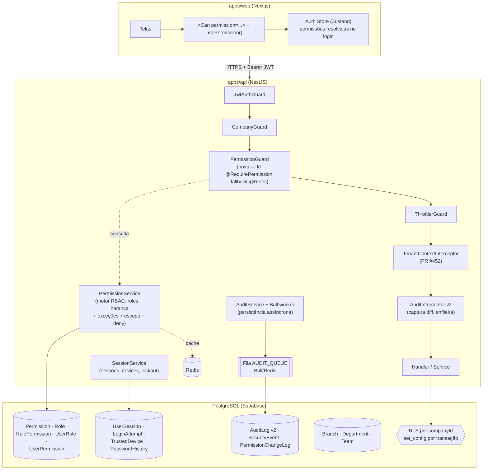
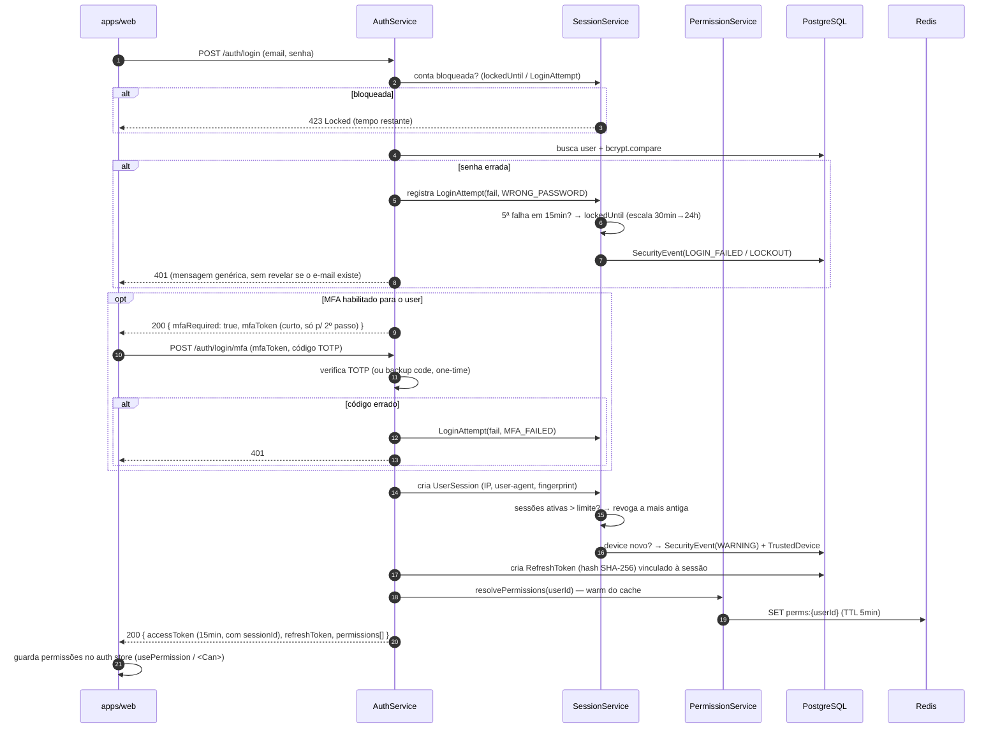
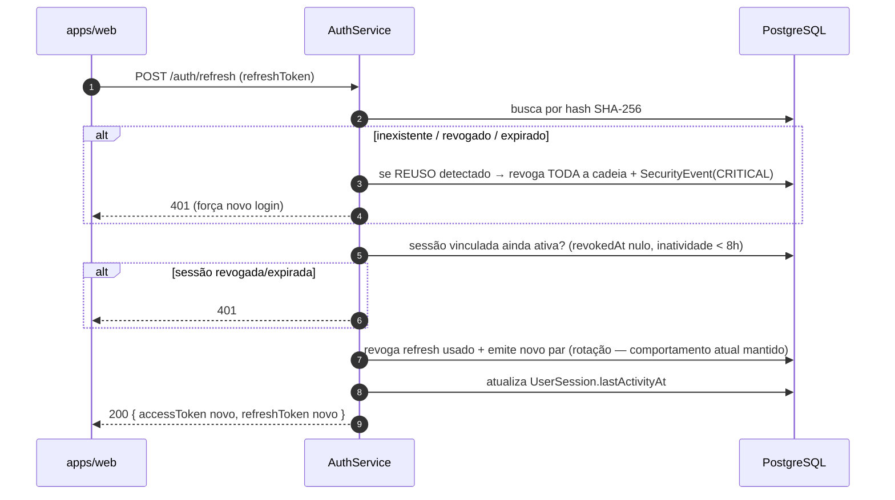
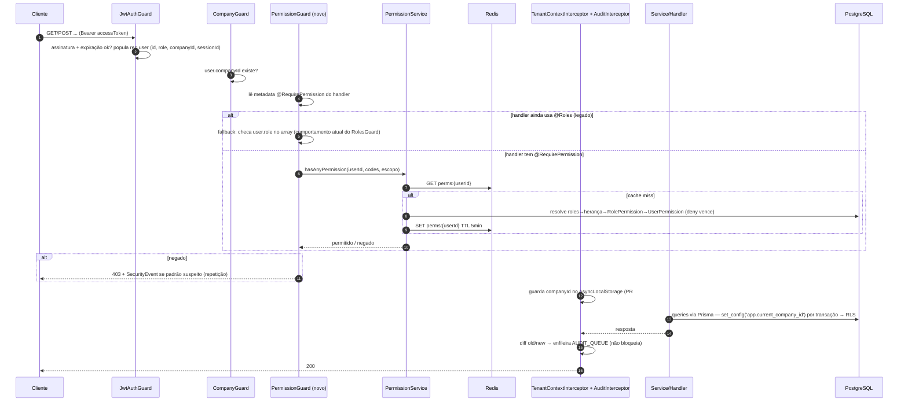

# Arquitetura IAM v2 — Análise Crítica e Proposta (#334)

> **Status:** proposta para decisão · **Data:** 03/07/2026 · **Autor:** Claude (F0.1 do milestone IAM)
> **Decisor final:** Rafael. Este documento recomenda; **nenhuma decisão aqui é definitiva sem o OK dele.**

Este é o entregável da issue #334 — a fase 0 do milestone **IAM — Arquitetura de Segurança Enterprise** (issues #334–#354). Não há código aqui: é o mapa que orienta todo o código que vem depois.

**Como ler este documento (se você não é técnico):**

- **IAM** = Identity and Access Management — "gestão de identidade e acesso". É a parte do sistema que responde três perguntas: *quem é você?* (autenticação), *o que você pode fazer?* (autorização) e *o que você fez?* (auditoria).
- **Parte 1** conta a verdade sobre o que existe hoje (a issue #334 foi escrita antes de uma rodada de correções e está desatualizada — corrigimos isso aqui).
- **Parte 2 em diante** propõe o sistema novo: banco de dados, fluxos, telas e o caminho de migração sem quebrar nada.
- **Parte 6** contém as 5 decisões que o Rafael precisa bater o martelo.

---

## Índice

1. [Parte 1 — Análise crítica do estado atual (o estado REAL)](#parte-1)
2. [Parte 2 — Proposta da arquitetura IAM v2](#parte-2)
3. [Parte 3 — Modelo ER proposto](#parte-3)
4. [Parte 4 — Matriz RBAC draft (22+ perfis)](#parte-4)
5. [Parte 5 — Fluxos de autenticação e autorização](#parte-5)
6. [Parte 6 — As 5 decisões arquiteturais (recomendações)](#parte-6)
7. [Parte 7 — Estratégia de migração sem quebrar nada](#parte-7)
8. [Parte 8 — Mapeamento issue a issue (#335–#354)](#parte-8)

---

<a id="parte-1"></a>
## Parte 1 — Análise crítica do estado atual (o estado REAL)

### 1.1 Aviso importante: a issue #334 está desatualizada

A issue #334 foi escrita com base na auditoria de 22/06/2026 ("score 15/100"). Entre a escrita da issue e este documento, houve o **hardening de 03/07/2026**: parte foi **mergeada na main** e parte está em **9 PRs abertos (#450–#457, #459, #460)** aguardando revisão do Rafael. A tabela abaixo corrige o texto da issue, item por item, com base no **código real verificado** em 03/07/2026:

| Afirmação da issue #334 | Estado REAL verificado | Onde |
|---|---|---|
| "IDOR em 35+ métodos — companyId via query/body (#158)" | **Corrigido.** O padrão `@Query('companyId')` já foi eliminado da main; o resíduo (16 DTOs de criação que ainda aceitavam `companyId` no body) foi corrigido no **PR #450** (aberto) | PR #450; grep na main confirma zero `@Query('companyId')` |
| "Guards não globais / aplicados por controller" | **Corrigido na main.** `JwtAuthGuard` → `CompanyGuard` → `RolesGuard` → `ThrottlerGuard` registrados como `APP_GUARD` globais, nessa ordem | `apps/api/src/app.module.ts:151-167` |
| "ThrottlerModule não instalado" | **Instalado e global** na main (rate limiting básico ativo) | `apps/api/src/app.module.ts:97` |
| "Helmet não instalado" | **Instalado** na main (`app.use(helmet())`) | `apps/api/src/main.ts:11` |
| "Sem exception filter global" | **Existe** (`AllExceptionsFilter`, sem stack trace em prod) | `apps/api/src/main.ts:15` |
| "Env vars não validadas no boot" | **Parcial na main** (Joi valida `DATABASE_URL`, `JWT_SECRET`, `REDIS_URL`…); schema **completo** (inclui `JWT_REFRESH_SECRET`, webhook fiscal, `BANK_ENCRYPTION_KEY`) no **PR #455** (aberto) | `apps/api/src/app.module.ts:63-76`; PR #455 |
| "Sem SoD — mesmo user cria e aprova (#160)" | **Corrigido no PR #454** (aberto): criador ≠ aprovador + aprovadores distintos por nível na matriz de alçada | PR #454 (`approval.service.ts`) |
| "TenantMiddleware (SET LOCAL app.current_company_id)" | O middleware era **código morto** (rodava ANTES do JwtAuthGuard → `req.user` sempre vazio → o SET nunca executou). O **PR #452** (aberto) remove o middleware e injeta `set_config(..., local=true)` **dentro de cada transação** via Prisma extension | PR #452; `tenant.middleware.ts` (ainda na main, morto) |
| "RLS Supabase — políticas não verificadas" | Políticas **existem e estão corretas** (migrations `phase7_rls`), **mas a RLS está inativa na prática**: a API conecta como o role `postgres` (dono das tabelas), que **ignora RLS**. Precisa de `FORCE ROW LEVEL SECURITY` ou role dedicado — decisão de infra pendente | PR #452, seção "Estado REAL da RLS" |
| "Cobertura de @Roles inconsistente" | **Corrigido no PR #453** (aberto): ~28 dos 40 controllers não tinham `@Roles`; agora **100% das mutations exigem perfil**, com matriz documentada em `docs/RBAC.md` daquela branch | PR #453 |
| "Auth module sem testes (#203)" | **Corrigido em parte no PR #456** (aberto): 51 testes novos cobrindo guards, exception filter, audit interceptor e módulo user (100% de linhas nos alvos) | PR #456 |
| "Frontend sem proteção de rota" | **Corrigido no PR #457** (aberto): guard de rota por role no `apps/web` (defesa de UX; a segurança real segue no backend) | PR #457 |
| CLAUDE.md: "BankAccount credentials com AES-256-GCM (EncryptionService)" | **FALSO — o EncryptionService NÃO existe.** `BANK_ENCRYPTION_KEY` só aparece em documentação (`CLAUDE.md`, `DEPLOY.md`, `render.yaml`); nenhum `.ts` a usa. A doc está à frente do código. O PR #459 corrige o CLAUDE.md | grep no repo; PR #455 (investigação); PR #459 |

**Conclusão da correção:** o "score 15/100" da issue não descreve mais o sistema. Com a main atual + os 9 PRs abertos, a **camada de proteção perimetral** (guards globais, headers, rate limit básico, validação de input, RBAC por enum em 100% das mutations, SoD, IDOR eliminado) está razoável. O que **continua faltando é estrutural** — e é exatamente o escopo do IAM v2.

### 1.2 O que existe e funciona hoje (main + PRs abertos)

**Autenticação** (`apps/api/src/modules/auth/`):
- Login local com e-mail/senha; hash de senha com **bcryptjs** (`auth.service.ts:25`).
- **JWT access token** (curto) + **refresh token** (longo) com **rotação**: o refresh é single-use, armazenado no banco como **hash SHA-256** (`auth.service.ts:15`), revogado ao usar (`revokedAt`).
- Payload do JWT: `sub`, `email`, `role`, `companyId` (`jwt.strategy.ts:16-23`).
- Check de `isActive` no login.
- `SupplierTokenGuard` para o portal do fornecedor (token próprio, fora do fluxo JWT).

**Autorização:**
- 10 perfis fixos no enum `UserRole` do Prisma: `SUPER_ADMIN, DIRECTOR, MANAGER, COMMERCIAL, PRODUCTION, QUALITY, WAREHOUSE, FINANCIAL, STORE, READER`.
- `RolesGuard` global lê o decorator `@Roles(...)`; **endpoint sem `@Roles` = liberado para qualquer logado** (após o PR #453, isso vale só para leituras não sensíveis).
- `CompanyGuard` global: bloqueia usuário sem `companyId`.
- `ApprovalMatrix` (alçadas de aprovação por valor/nível) + SoD no PR #454.

**Infraestrutura de segurança:**
- Helmet, ThrottlerGuard global, `ValidationPipe` global (whitelist + forbidNonWhitelisted), `AllExceptionsFilter`, CORS restrito, validação Joi de env no boot.
- Bull + Redis já instalados e usados (fila `REPORT_QUEUE`) — relevante para a decisão de auditoria assíncrona.
- Tenant por transação (PR #452): `set_config('app.current_company_id', $1, true)` injetado em cada operação Prisma via client extension + `AsyncLocalStorage`.

**Modelo de dados atual (relevante a IAM):**

```
User           id, name, email, passwordHash, role (enum), isActive, companyId
RefreshToken   id, token (SHA-256), userId, expiresAt, revokedAt
Company        id, cnpj, name, dados fiscais
AuditLog       id, userId?, companyId, entity, action, payload (JSON)  ← tabela existe, NINGUÉM grava nela
ApprovalMatrix id, companyId, entityType, level, requiredApprovals, approverRoles[]
SupplierToken  id, supplierId, token, expiresAt, revokedAt
```

### 1.3 Gaps REAIS que permanecem (o que o IAM v2 precisa resolver)

Estes são os buracos verificados no código que **nenhum PR aberto resolve** — são o trabalho das issues #335–#354:

| # | Gap | Evidência | Risco |
|---|---|---|---|
| G1 | **Sem permissões granulares.** Autorização = 10 perfis fixos hardcoded. Não dá para dizer "o João aprova compras mas não vê financeiro" sem criar código novo. Perfis não são customizáveis pela empresa | `roles.guard.ts:23` (`requiredRoles.includes(user?.role)`) | Alto — perfis largos demais concentram poder |
| G2 | **AuditLog não persiste.** O `AuditInterceptor` global só faz `this.logger.log(...)` no console; a tabela `gdr_audit_logs` existe mas nada grava nela. Sem trilha: quem alterou um preço? Ninguém sabe | `audit.interceptor.ts:27-40` (só `logger.log`); schema `AuditLog` sem writers | Alto — sem accountability nem forense |
| G3 | **Sem sessões.** Não há registro de login, dispositivo, IP, sessões simultâneas. Impossível "derrubar" um usuário comprometido: o access token vale até expirar e o refresh até ser usado | ausência de qualquer model de sessão no schema | Alto |
| G4 | **Sem lockout.** Tentativas de senha erradas são ilimitadas (o Throttler limita por IP, mas não trava a conta) | `auth.service.ts` (nenhum contador de falhas) | Médio-alto — brute-force distribuído passa |
| G5 | **Sem MFA/2FA** | — | Médio-alto para perfis admin |
| G6 | **Sem password policy.** Sem complexidade mínima, histórico, expiração ou troca forçada no primeiro acesso | — | Médio |
| G7 | **Access token irrevogável.** JWT stateless puro: demitiu alguém, o token continua válido até expirar | `jwt.strategy.ts` (validação só criptográfica) | Médio (mitigado por expiração curta) |
| G8 | **RLS inativa na prática.** Policies existem, encanamento chega ao banco (PR #452), mas o role `postgres` é dono das tabelas e ignora RLS. Defesa em profundidade no banco = zero | PR #452, seção "Estado REAL da RLS" | Médio — a única barreira é o `where { companyId }` no código |
| G9 | **Escopo de tenant é só empresa.** Não existe Filial/Departamento/Equipe como escopo de permissão — o gerente da loja de Guaratuba vê os dados da matriz | schema (nenhum model Branch/Department/Team) | Médio (3 filiais reais na GDR) |
| G10 | **SUPER_ADMIN sem freios.** Nenhum log especial, nenhum "break-glass", nenhuma segunda aprovação para ações destrutivas | — | Médio |
| G11 | **EncryptionService inexistente** apesar de documentado. Credenciais bancárias (quando entrarem) não têm criptografia em repouso | grep: zero usos de `BANK_ENCRYPTION_KEY` em `.ts` | Latente (o dado ainda não é gravado) |
| G12 | **Auth extensível a SSO = zero.** `AuthService` acoplado a senha local; nenhum campo `authProvider`/`externalId` | `auth.service.ts` | Baixo hoje, caro depois |

---

<a id="parte-2"></a>
## Parte 2 — Proposta da arquitetura IAM v2

### 2.1 Visão geral (o desenho de componentes)



**Princípios de projeto** (na ordem de prioridade):

1. **O backend é a única fonte de verdade de autorização.** Frontend só melhora a UX escondendo o que o usuário não pode fazer.
2. **Migração aditiva e convivência.** Nada é derrubado: `User.role` (enum) continua existindo e funcionando durante toda a migração; `@Roles` e `@RequirePermission` convivem.
3. **Deny explícito vence grant.** Se qualquer regra negar, está negado.
4. **Tudo que muda permissão gera log** (quem, quando, o quê, por quê).
5. **Defesa em profundidade:** guard na API + `where { companyId }` no código + RLS no banco (quando ativada).

### 2.2 Os blocos da proposta

**Bloco A — RBAC granular com permissões no banco** (issues #335, #338, #339, #340, #341)

- **Permission**: catálogo de todas as ações possíveis, no formato `modulo.recurso.acao` (ex.: `production.orders.approve`, `finance.receivables.process`). Estimativa: ~800–1.250 permissões geradas por seed idempotente.
- **Role (perfil)**: conjunto nomeado de permissões. Dois tipos:
  - `isSystem = true`: os 22+ perfis padrão (Parte 4), não editáveis — garantem baseline sã;
  - perfis customizados por empresa (`companyId` preenchido) — o admin da GDR pode criar "Comprador Júnior" clonando "Comprador" e tirando `purchases.orders.approve`.
- **Herança de perfis** (`parentId`): "Supervisor de Produção" herda tudo do "Operador de Produção" e acrescenta aprovações. Evita duplicar centenas de linhas.
- **UserRole**: usuário ↔ perfil, com escopo opcional de filial (`branchId`) e validade (`expiresAt` — perfil temporário, ex.: férias do gerente).
- **UserPermission (exceções)**: grant ou **deny** pontual por usuário, com justificativa obrigatória (`reason`) e validade. É a válvula de escape que evita criar um perfil novo para cada caso especial.
- **PermissionService**: motor central que resolve "o usuário X pode Y no escopo Z?" considerando roles + herança + exceções + escopo + expiração, com **cache Redis** (detalhes na Decisão 2).
- **PermissionGuard + `@RequirePermission('modulo.recurso.acao')`**: substitui gradualmente o `@Roles` (convivência descrita na Parte 7).

**Bloco B — Sessões, dispositivos e lockout** (issues #336, #342)

- **UserSession**: cada login cria uma sessão com IP, user-agent, fingerprint do device, geo aproximada; `lastActivityAt` atualizado com debounce. Limite de sessões simultâneas configurável (default 5). Admin e o próprio usuário podem revogar sessões; logout global revoga tudo.
- **LoginAttempt**: toda tentativa (sucesso/falha + motivo) registrada. Base do lockout: 5 falhas em 15 min → trava 30 min, escalando (30min → 1h → 2h → 4h → 24h). Admin destrava manualmente.
- **TrustedDevice**: device novo gera `SecurityEvent`; usuário pode marcar como confiável (futuro: pular MFA em device confiável).
- Amarração com o token: ver Decisão 4 (híbrido).

**Bloco C — Auditoria enterprise** (issues #337, #343)

- **AuditLog v2**: quem (`userId`, `sessionId`), o quê (`entity`, `entityId`, `action`, `module`), **diff** (`oldValue`/`newValue`), contexto (`ipAddress`, `userAgent`, `requestId`, `duration`). Nunca deletado; retenção 7 anos fiscal / 5 anos geral.
- **SecurityEvent**: eventos de segurança (login, falha, lockout, troca de senha, mudança de role, sessão revogada, atividade suspeita) com severidade — alimenta alertas.
- **PermissionChangeLog**: trilha específica e imutável de toda mudança de acesso.
- **AuditInterceptor v2** captura e **enfileira** (Bull); worker persiste. Detalhes na Decisão 5.

**Bloco D — Credenciais fortes** (issues #344, #345)

- **MFA TOTP** (Google Authenticator/Authy) com QR code, 10 backup codes hasheados, enforcement configurável por empresa (`OPTIONAL` / `REQUIRED_ADMINS` / `REQUIRED_ALL`) com grace period de 7 dias. Secret TOTP criptografado — **pré-requisito: criar o EncryptionService de verdade** (G11).
- **Password policy**: complexidade configurável, `PasswordHistory` (não repetir as últimas 5), expiração opcional (90 dias), `mustChangePassword` no primeiro acesso e no reset por admin.

**Bloco E — Preparação OAuth/SSO** (issue #346 — preparar, NÃO implementar)

- Campos `authProvider` (`LOCAL | GOOGLE | MICROSOFT | AZURE_AD | SAML`) e `externalId` no User; tabela `AuthProvider` (config por empresa); `AuthService` refatorado para strategy pattern (o login local vira a primeira strategy). Zero fluxo OAuth agora.

**Bloco F — Multi-tenant hierárquico** (issue #347)

- Models `Branch`, `Department`, `Team` + junctions `UserDepartment`/`UserTeam`. Escopo de permissão em JSON (`{"branch": ["CWB"]}`). Extensão do escopo na Decisão 3.

**Bloco G — Frontend** (issues #351, #352)

- `GET /auth/permissions` no login → set de codes no auth store; hook `usePermission()`, componente `<Can>`, auto-hide de sidebar/botões/ações; telas de administração de perfis, usuários (com sessões e exceções) e matriz de permissões. O route guard por role do PR #457 evolui para guard por permissão.

---

<a id="parte-3"></a>
## Parte 3 — Modelo ER proposto

Compatível com o schema atual: **nenhuma tabela existente é alterada de forma destrutiva**. `User.role` (enum) **permanece** durante toda a migração como fallback. Prefixo de tabela `gdr_` mantido. Campos novos no `User` são todos opcionais/default (aditivos).

```mermaid
erDiagram
    %% ============ EXISTENTES (mantidas) ============
    Company ||--o{ User : "tem"
    User ||--o{ RefreshToken : "tem"
    User {
        string id PK
        string email UK
        string passwordHash
        UserRole role "ENUM ATUAL - MANTIDO como fallback"
        boolean isActive
        string companyId FK
        string authProvider "NOVO: default LOCAL"
        string externalId "NOVO: nullable (SSO futuro)"
        datetime passwordChangedAt "NOVO"
        boolean mustChangePassword "NOVO: default false"
        datetime lockedUntil "NOVO: nullable (lockout)"
    }

    %% ============ RBAC CORE (novas) ============
    Permission {
        string id PK
        string code UK "modulo.recurso.acao"
        string name "pt-BR"
        string module
        string resource
        string action
    }
    Role {
        string id PK
        string code UK
        string name
        boolean isSystem "true = nao editavel"
        string parentId FK "heranca"
        string companyId FK "null = global"
    }
    RolePermission {
        string id PK
        string roleId FK
        string permissionId FK
        json scope "ex: branch CWB; null = sem restricao"
        boolean granted "false = deny explicito"
    }
    UserRole_ {
        string id PK
        string userId FK
        string roleId FK
        string companyId FK
        string branchId FK "null = todas as filiais"
        datetime expiresAt "role temporario"
        string grantedBy FK
    }
    UserPermission {
        string id PK
        string userId FK
        string permissionId FK
        string companyId FK
        boolean granted "excecao: grant OU deny"
        json scope
        datetime expiresAt
        string grantedBy FK
        string reason "justificativa obrigatoria"
    }
    Role ||--o{ RolePermission : ""
    Permission ||--o{ RolePermission : ""
    Role ||--o{ Role : "parent (heranca)"
    User ||--o{ UserRole_ : ""
    Role ||--o{ UserRole_ : ""
    User ||--o{ UserPermission : ""
    Permission ||--o{ UserPermission : ""
    Company ||--o{ Role : "perfis customizados"

    %% ============ ORGANIZACAO (novas) ============
    Branch {
        string id PK
        string code "CWB JOI GUA"
        string companyId FK
        string cnpj
        boolean isActive
    }
    Department {
        string id PK
        string companyId FK
        string managerId FK
        string parentId FK "hierarquico"
    }
    Team {
        string id PK
        string departmentId FK
        string leaderId FK
    }
    Company ||--o{ Branch : ""
    Company ||--o{ Department : ""
    Department ||--o{ Team : ""
    Department ||--o{ Department : "parent"
    User }o--o{ Department : "UserDepartment"
    User }o--o{ Team : "UserTeam"

    %% ============ SESSOES (novas) ============
    UserSession {
        string id PK
        string userId FK
        string companyId FK
        string refreshTokenId FK "amarra sessao ao refresh"
        string ipAddress
        string userAgent
        string deviceFingerprint
        datetime lastActivityAt
        datetime revokedAt
        string revokedReason "LOGOUT EXPIRED ADMIN_REVOKE SECURITY"
    }
    LoginAttempt {
        string id PK
        string email "indexado"
        string ipAddress "indexado"
        boolean success
        string failReason "WRONG_PASSWORD INACTIVE LOCKED MFA_FAILED"
    }
    TrustedDevice {
        string id PK
        string userId FK
        string fingerprint
        string name
        boolean trusted
        datetime lastSeenAt
    }
    User ||--o{ UserSession : ""
    RefreshToken ||--o| UserSession : ""
    User ||--o{ TrustedDevice : ""

    %% ============ CREDENCIAIS (novas) ============
    UserMFA {
        string id PK
        string userId FK "unique"
        string secret "criptografado (EncryptionService)"
        boolean enabled
        string backupCodes "10 codigos hasheados"
    }
    PasswordHistory {
        string id PK
        string userId FK
        string hash "bcrypt"
    }
    User ||--o| UserMFA : ""
    User ||--o{ PasswordHistory : ""

    %% ============ AUDITORIA (novas - AuditLog v1 mantida) ============
    AuditLogV2 {
        string id PK
        string companyId FK
        string userId FK
        string sessionId FK
        string entity
        string entityId "indexado"
        string action "enum CREATE UPDATE DELETE APPROVE..."
        string module
        json oldValue
        json newValue
        string ipAddress
        string requestId "correlacao"
        int duration "ms"
    }
    SecurityEvent {
        string id PK
        string companyId FK
        string userId FK
        string eventType "LOGIN_FAILED LOCKOUT ROLE_CHANGED..."
        string severity "INFO WARNING CRITICAL"
        json metadata
    }
    PermissionChangeLog {
        string id PK
        string companyId FK
        string targetUserId FK
        string changedByUserId FK
        string changeType "ROLE_ASSIGNED PERMISSION_REVOKED..."
        json previousState
        json newState
        string reason
    }
    User ||--o{ AuditLogV2 : ""
    UserSession ||--o{ AuditLogV2 : ""
    User ||--o{ SecurityEvent : ""

    %% ============ SSO PREP (nova) ============
    AuthProvider {
        string id PK
        string type "GOOGLE MICROSOFT AZURE_AD SAML"
        json config
        boolean enabled
        string companyId FK
    }
    Company ||--o{ AuthProvider : ""
```



Notas de compatibilidade:

- `UserRole_` no diagrama = model `UserAssignedRole` no Prisma (o nome `UserRole` já é usado pelo **enum** atual — não podemos colidir; sugestão de nome: `UserRoleAssignment`).
- A tabela `gdr_audit_logs` atual (v1) **não é alterada nem removida** — a v2 nasce ao lado (ex.: `gdr_audit_logs_v2`) e a v1 é aposentada depois, sem DROP (regra do projeto: migrations nunca fazem DROP).
- `RefreshToken`, `SupplierToken` e `ApprovalMatrix` seguem como estão; `UserSession.refreshTokenId` referencia o RefreshToken existente.

---

<a id="parte-4"></a>
## Parte 4 — Matriz RBAC draft

### 4.1 Ponto de partida: os 10 perfis atuais já mapeados

O **PR #453** já produziu, em `docs/RBAC.md` (branch `sec/rbac-matrix`), a matriz completa **endpoint por endpoint** dos 10 perfis enum atuais — leitura vs. escrita em todos os ~40 controllers, no princípio "na dúvida, restringir". **Aquele documento é o baseline oficial desta proposta**: quando as permissões granulares nascerem (seeds da #338), cada linha daquela matriz vira um conjunto de `RolePermission` do perfil system correspondente. Nada do que foi decidido lá se perde — é traduzido de "perfil → endpoints" para "perfil → permissões".

### 4.2 Os 22+ perfis da issue #339 e o mapeamento dos enum atuais

| # | Perfil novo (system) | Herda de | Equivale ao enum atual |
|---|---|---|---|
| 1 | Administrador Global | — | `SUPER_ADMIN` |
| 2 | Administrador da Empresa | — | — (novo) |
| 3 | Administrador da Filial | — | — (novo) |
| 4 | Diretor | — | `DIRECTOR` |
| 5 | Gerente Industrial | — | ~`MANAGER` (parte industrial) |
| 6 | Gerente Financeiro | — | ~`FINANCIAL` (elevado) |
| 7 | Gerente Comercial | — | ~`COMMERCIAL` (elevado) |
| 8 | Gerente de Compras | — | — (novo) |
| 9 | Supervisor de Produção | Operador Produção | — (novo) |
| 10 | Supervisor de Estoque | Almoxarife | — (novo) |
| 11 | Coordenador Comercial | Vendedor | — (novo) |
| 12 | Comprador | — | — (novo) |
| 13 | Vendedor | — | `COMMERCIAL` |
| 14 | Operador PCP | — | `PRODUCTION` (parte planejamento) |
| 15 | Operador Produção | — | `PRODUCTION` (chão de fábrica) |
| 16 | Almoxarife | — | `WAREHOUSE` |
| 17 | Financeiro | — | `FINANCIAL` |
| 18 | Fiscal | — | ~`FINANCIAL` (parte fiscal) |
| 19 | RH | — | — (novo) |
| 20 | Qualidade | — | `QUALITY` |
| 21 | Assistência Técnica | — | — (novo) |
| 22 | Auditor | — | — (novo) |
| 23 | Somente Leitura | — | `READER` |
| 24 | Visitante | — | — (novo) |
| — | Loja (Filial) | Almoxarife (parcial) | `STORE` — mantido como perfil system para a migração 1:1 |

**Migração automática dos usuários existentes:** seed cria os perfis system e insere, para cada usuário, um `UserRoleAssignment` apontando para o perfil equivalente ao seu `User.role` atual (tabela acima, coluna 4 na direção inversa). O enum não é tocado.

### 4.3 Matriz resumida (draft — validação de negócio pendente)

Legenda: ★ = CRUD completo + aprovar · V = ver · C = criar · E = editar · A = aprovar · X = executar (apontamentos/WMS) · − = sem acesso.

| Perfil | Dashboard | Produtos | Vendas | Compras | Estoque/WMS | Produção | Qualidade | Financeiro | Fiscal | Config/Usuários | Auditoria |
|---|---|---|---|---|---|---|---|---|---|---|---|
| Admin Global | ★ | ★ | ★ | ★ | ★ | ★ | ★ | ★ | ★ | ★ | ★ |
| Admin Empresa | ★ | ★ | ★ | ★ | ★ | ★ | ★ | ★ | ★ | ★ (sem global) | V |
| Admin Filial | ★ (filial) | V | ★ (filial) | ★ (filial) | ★ (filial) | ★ (filial) | V | V (filial) | − | V | − |
| Diretor | V | V,E | V,A | V,A | V | V,A | V | V,A | V | V | V |
| Ger. Industrial | V | V | V | V | ★ | ★ | ★ | − | − | − | − |
| Ger. Financeiro | V | V | V | V | − | − | − | ★ | ★ | − | − |
| Ger. Comercial | V | V,E | ★ | − | V | − | − | V (CR) | − | − | − |
| Ger. Compras | V | V | − | ★ | V | − | − | V (CP) | − | − | − |
| Superv. Produção | V | V | − | − | V | herda Operador + A | V | − | − | − | − |
| Superv. Estoque | V | V | − | V | herda Almox. + A | V | − | − | − | − | − |
| Coord. Comercial | V | V | herda Vendedor + A | − | V | − | − | − | − | − | − |
| Comprador | V | V | − | C,E,V | V | − | − | − | − | − | − |
| Vendedor | V | V | C,E,V | − | V | − | − | − | − | − | − |
| Operador PCP | V | V | − | V | V | C,E,V | − | − | − | − | − |
| Operador Produção | V | V | − | − | V | V,X | − | − | − | − | − |
| Almoxarife | V | V | − | C (solicitação) | ★ | V | − | − | − | − | − |
| Financeiro | V | V | V | V | − | − | − | C,E,V + processar | V | − | − |
| Fiscal | V | V | V | V | − | − | − | V | C,E,V + emitir | − | − |
| RH | V | − | − | − | − | − | − | − | − | usuários C,E,V | − |
| Qualidade | V | V | − | − | V | V | ★ | − | − | − | − |
| Assist. Técnica | V | V | − | − | V | − | − | − | − | manutenção ★ | − |
| Auditor | V | V | V | V | V | V | V | V | V | V | ★ (leitura+export) |
| Somente Leitura | V | V | V | V | V | V | V | V | V | − | − |
| Visitante | V | − | − | − | − | − | − | − | − | − | − |
| Loja (Filial) | V | V | − | C (solicitação) | transferências | − | − | − | − | − | − |

> ⚠️ **Draft.** A granularidade final (ação por ação) é trabalho das issues #338/#339, e a validação de quem-pode-o-quê é do Rafael — mesma ressalva já feita no `docs/RBAC.md` do PR #453.

---

<a id="parte-5"></a>
## Parte 5 — Fluxos de autenticação e autorização propostos

### 5.1 Login (com sessão, lockout e MFA)



### 5.2 Refresh com rotação (já existe) + validação de sessão (novo)



### 5.3 Autorização em cada request (guards + PermissionService)



**Invalidação do cache de permissões:** todo grant/revoke (role ou exceção) deleta `perms:{userId}` no Redis imediatamente (além do TTL de 5 min como rede de segurança). Revogação de sessão/desativação de usuário: ver Decisão 4.

---

<a id="parte-6"></a>
## Parte 6 — As 5 decisões arquiteturais

> Cada decisão traz opções, trade-offs e **uma recomendação com o porquê**. **Quem decide é o Rafael** — o restante do roadmap (#335–#354) assume as recomendações, mas foi desenhado para sobreviver a escolhas diferentes.

### Decisão 1 — RBAC puro vs. RBAC + ABAC

*(ABAC = autorização por atributos/regras dinâmicas, ex.: "aprova compras SE valor < R$ 50 mil E for da mesma filial")*

| | RBAC puro | RBAC + ABAC completo |
|---|---|---|
| Prós | Simples de entender, auditar e explicar ("quem tem o perfil X pode Y"); UI de administração viável; performance previsível | Regras finas por valor/horário/local; menos perfis |
| Contras | Casos condicionais (alçada por valor) precisam de mecanismo à parte | Complexidade explode (policy engine, debugging difícil: "por que o João não conseguiu?"); overkill para ~30–60 usuários |

**Recomendação: RBAC estruturado + "ABAC mínimo e cercado"** — três atributos só, cada um com dono claro:
1. **Escopo organizacional** (filial/departamento) como campo `scope` do RolePermission/UserPermission — já previsto no modelo;
2. **Alçada por valor** continua no `ApprovalMatrix` (já existe e funciona, com SoD do PR #454) — não reinventar;
3. **Ownership** (`isOwner` — ex.: vendedor edita só os próprios orçamentos) como método do PermissionService, usado caso a caso.

**Por quê:** cobre 100% dos casos reais da GDR hoje sem policy engine. Um ABAC genérico (OPA, Casbin, CASL server-side com condições dinâmicas) é caro de operar e ninguém além do autor entende as regras seis meses depois. Se um dia precisar, o formato `scope` JSON já é a semente.

### Decisão 2 — Permissões no banco vs. hardcoded com cache

| | No banco (+ cache Redis) | Hardcoded no código (const/enum) |
|---|---|---|
| Prós | Perfis customizáveis por empresa **sem deploy**; exceções por usuário; tela de administração (#352) possível; trilha de mudanças (PermissionChangeLog) | Zero latência; impossível "quebrar" permissão por dado errado |
| Contras | Precisa de cache + invalidação; seed disciplinado | Toda mudança de acesso = PR + deploy; inviabiliza o requisito central do milestone (perfis customizáveis) |

**Recomendação: no banco, com cache Redis (TTL 5 min + invalidação ativa) e catálogo de permissões versionado em código.** O *catálogo* (a lista de codes `modulo.recurso.acao`) nasce de um arquivo TypeScript versionado que gera o seed idempotente — o banco nunca inventa permissão que o código não conhece; já os *vínculos* (perfil ↔ permissões, usuário ↔ perfis) são dados vivos no banco.

**Por quê:** é o único caminho que entrega a tela #352 e as exceções com justificativa. O custo de performance é neutralizado pelo cache (meta da #340: `can()` < 5ms com cache) e o Redis já está na stack (Bull). O híbrido "catálogo em código + vínculos no banco" dá o melhor dos dois mundos: type-safety nos decorators (`@RequirePermission` só aceita codes existentes) e flexibilidade nos dados.

### Decisão 3 — Escopo de tenant: empresa → filial → departamento → equipe

| Nível | Uso como **segurança** (restringe dados) | Uso como **organização** (agrupa pessoas) |
|---|---|---|
| Empresa | Já é o tenant (companyId em tudo + RLS) | — |
| Filial (Branch) | **Sim — necessário.** GDR tem 3 filiais reais; "gerente da loja não vê a matriz" é requisito | Também |
| Departamento | Raramente restringe dados no ERP (produção vê estoque, financeiro vê vendas) | **Sim** — dono de centro de custo, aprovações, RH |
| Equipe | Quase nunca restringe | Sim — turnos, times de venda |

**Recomendação: dois estágios.**
- **Agora (IAM v2 núcleo):** segurança em **dois níveis — Empresa + Filial**. `branchId` no `UserRoleAssignment` e `scope {"branch": [...]}` nas permissões, verificados pelo PermissionService.
- **Depois (#347 fase 2):** `Department` e `Team` entram como **estrutura organizacional** (junctions, gestor, líder — úteis para SoD, alçadas e RH), **sem** participar do cálculo de permissão até existir um caso real que exija.

**Por quê:** cada nível de escopo de segurança multiplica a complexidade de *toda* query e de *todo* teste. Filial tem demanda concreta (3 lojas); departamento/equipe restringindo dados é hipotético hoje. O modelo (scope JSON) já suporta os níveis extras — ligar depois é barato; desligar depois de ligado é quase impossível.

### Decisão 4 — Token: JWT stateless vs. session-based vs. híbrido

| | JWT stateless puro (atual) | Sessão pura no banco | **Híbrido** |
|---|---|---|---|
| Revogação imediata | Impossível (G7) | Imediata | Refresh: imediata; access: na prática ≤ 15 min (ou imediata p/ ações sensíveis) |
| Custo por request | Zero I/O | 1 query sempre | Zero I/O no caminho comum |
| Sessões/dispositivos/limite | Não existe | Nativo | Nativo (via UserSession) |

**Recomendação: híbrido.**
- **Access token JWT curto (15 min), validado só criptograficamente** no caminho comum (zero I/O extra por request) — carrega `sub`, `companyId`, `role` (compat) e **`sessionId`** (novo claim).
- **Refresh amarrado à `UserSession`**: revogar a sessão mata o refresh → o usuário cai em no máximo 15 minutos, sem tocar no throughput da API.
- **Válvulas para revogação imediata onde importa:** (a) endpoints sensíveis (troca de senha, gestão de usuários/permissões, financeiro acima de alçada) checam a sessão no banco via decorator `@RequireFreshSession`; (b) desativação de usuário/lockout coloca o `userId` numa **denylist curta no Redis** (TTL = vida restante do access token, ~15 min) consultada pelo JwtAuthGuard — é um GET no Redis, não no banco.
- **Não** fazer blacklist de todos os access tokens nem validação de sessão em todo request.

**Por quê:** resolve G3 (sessões/dispositivos/limite/logout global) e G7 (revogação) mantendo a característica que faz o sistema atual ser rápido. Sessão pura penalizaria todos os requests para proteger contra uma janela de 15 minutos; a denylist Redis fecha essa janela nos casos críticos por custo irrisório. É também o desenho que menos mexe no que já funciona (refresh com rotação SHA-256 permanece igual, só ganha o vínculo com a sessão).

### Decisão 5 — Auditoria: sync vs. fila (async) vs. CDC

| | Síncrona (grava no request) | **Fila (Bull/Redis)** | CDC (captura no banco, ex.: pgAudit/logical replication) |
|---|---|---|---|
| Latência no usuário | +5–20ms por mutation | ~0 (enfileira em memória/Redis) | 0 |
| Garantia | Forte (mesma transação) | Boa (Redis persistente + retry + DLQ); perde-se só se o Redis morrer no intervalo | Forte no banco, mas **sem contexto de aplicação** (não sabe qual usuário/sessão/request) |
| Diff old/new | Precisa buscar o "antes" | Idem (interceptor captura antes do handler) | Nativo (linha antes/depois) |
| Complexidade | Baixa | Baixa-média (Bull **já está na stack**) | Alta (infra Supabase, novo pipeline) |

**Recomendação: fila Bull (async) como caminho padrão + gravação síncrona apenas para `SecurityEvent` e `PermissionChangeLog`.**
- Mutations de negócio (audit trail de CRUD): interceptor captura diff → `AUDIT_QUEUE` → worker persiste em lote. Retry com backoff + dead-letter queue; se o Redis estiver fora, fallback síncrono (degrada latência, não perde log).
- Eventos de **segurança** (lockout, mudança de permissão, login suspeito) e a trilha de mudanças de acesso são poucos, críticos e legalmente sensíveis → gravam **na mesma transação** da ação. Auditoria de permissão que se perde numa fila é auditoria que não existe.
- CDC: **não agora.** Fica registrado como evolução possível se um dia a exigência for "à prova de aplicação" (compliance pesado).

**Por quê:** a issue #337 já pede escrita async via Bull, o Bull/Redis já roda em produção (fila de relatórios), e o custo de latência da opção síncrona incidiria sobre *toda* mutation do ERP. A divisão "negócio async / segurança sync" dá o equilíbrio certo entre performance e garantia.

### Resumo das 5 recomendações

| # | Decisão | Recomendação |
|---|---|---|
| 1 | RBAC vs ABAC | RBAC estruturado + ABAC mínimo (escopo org., alçada via ApprovalMatrix, ownership pontual) |
| 2 | Permissões banco vs código | Banco + cache Redis; catálogo de codes versionado em código gerando seed |
| 3 | Escopo de tenant | Empresa + Filial como segurança agora; Departamento/Equipe como organização depois |
| 4 | Token strategy | Híbrido: JWT 15min stateless + UserSession no refresh + denylist Redis p/ revogação crítica |
| 5 | Auditoria | Async via Bull para negócio; síncrona para SecurityEvent/PermissionChangeLog; CDC não |

---

<a id="parte-7"></a>
## Parte 7 — Estratégia de migração sem quebrar nada

**Regras invioláveis** (já são regras do projeto):
1. **Migrations só aditivas** — nenhum DROP, nenhum ALTER destrutivo. Tabelas novas nascem ao lado das velhas.
2. **`User.role` (enum) continua existindo e funcionando** até o fim da migração — é o fallback permanente.
3. **Cada fase entrega valor sozinha e é reversível** (desligar = voltar ao comportamento anterior, não restaurar backup).
4. **Zero downtime e zero re-login forçado** (tokens emitidos antes de cada fase continuam válidos até expirar).

### Fase M0 — Fundação de dados (issues #335, #336, #337)
Criar todas as tabelas novas (RBAC, sessões, auditoria v2, organização) **sem nenhum código as usando**. Migration roda, app continua idêntico. Risco: ~zero.

### Fase M1 — Seeds e espelhamento (issues #338, #339)
Seeds idempotentes: catálogo de permissões + 22+ perfis system + **espelhamento automático**: para cada usuário, criar `UserRoleAssignment` equivalente ao seu `User.role` (tabela da Parte 4.2). A partir daqui o banco tem as duas representações **em paralelo e consistentes**. App ainda não lê as tabelas novas.

### Fase M2 — Motor em modo sombra (issue #340)
`PermissionService` entra em produção em **shadow mode**: em cada request, o `RolesGuard` decide (comportamento atual), e o PermissionService calcula em paralelo e **loga divergências** sem bloquear ninguém. Uma semana de sombra = validação com tráfego real, risco zero para usuários. (Mesma técnica usada em migração de billing.)

### Fase M3 — Convivência @Roles → @RequirePermission (issue #341)
`PermissionGuard` substitui o `RolesGuard` global com **fallback embutido**:
```
handler tem @RequirePermission?  → decide pelo PermissionService
senão, tem @Roles?               → decide pelo enum (comportamento atual, bit a bit)
senão                            → permitido para autenticado (regra atual; pós-#453 só sobra leitura não sensível)
```
Controllers migram **um a um** (começando pelos de menor risco: dashboard, report), cada um em PR pequeno e revertível. O `docs/RBAC.md` do PR #453 é o gabarito da tradução `@Roles` → codes. O RolesGuard só é removido quando o grep de `@Roles(` zerar — e mesmo assim o enum fica no banco.

### Fase M4 — Sessões e lockout (issue #342)
Login passa a criar `UserSession` e registrar `LoginAttempt`. Tokens antigos (sem claim `sessionId`) continuam aceitos até expirarem (claim tratado como opcional durante a transição). Lockout entra com limites frouxos + alertas primeiro, aperta depois.

### Fase M5 — Auditoria persistida (issue #343)
AuditInterceptor v2 passa a enfileirar; worker grava na v2. O `logger.log` atual **permanece** durante a transição (dupla escrita barata). Tabela v1 intocada.

### Fase M6 — Credenciais (issues #344, #345 — dependem do EncryptionService)
Primeiro criar o **EncryptionService real** (AES-256-GCM, `BANK_ENCRYPTION_KEY` do PR #455 vira `required`). Depois MFA opt-in → enforcement por empresa com grace period; password policy só para senhas novas (nenhuma senha existente é invalidada; `mustChangePassword` conduz a adoção).

### Fase M7 — Escopo de filial + frontend (issues #347, #351, #352)
Branch entra no cálculo de permissão (default de todo mundo = "todas as filiais" → nada muda até alguém restringir). Frontend ganha `usePermission`/`<Can>`/telas de administração — o guard por role do PR #457 evolui para permissão.

### Fase M8 — Endurecimento final (issues #349, #353, e infra da RLS)
Rate limit por categoria de endpoint, CSP enforce, suite de testes de segurança completa, e a **decisão de infra da RLS** (role dedicado sem ownership ou `FORCE ROW LEVEL SECURITY` — pendência explícita do PR #452, com plano de rollback).

**Matriz de convivência (o que funciona em cada fase):**

| Fase | RolesGuard/enum | PermissionService | Sessões | Audit v2 |
|---|---|---|---|---|
| M0–M1 | decide tudo | inerte (dados prontos) | — | — |
| M2 | decide tudo | sombra (loga divergência) | — | — |
| M3 | fallback | decide onde há @RequirePermission | — | — |
| M4–M7 | fallback | decide na maioria | ativas | persistindo |
| M8+ | só o enum no banco (fallback removido do código) | decide tudo | ativas | fonte oficial |

---

<a id="parte-8"></a>
## Parte 8 — Mapeamento issue a issue (#335–#354)

Como cada issue do milestone implementa esta proposta — e o que **já foi coberto** pelo hardening de 03/07 (PRs #450–#457):

| Issue | O que implementa nesta proposta | Situação vs. PRs abertos | Ajuste recomendado |
|---|---|---|---|
| **#335** Schema RBAC core | Parte 3 (Permission, Role, RolePermission, UserRoleAssignment, UserPermission, Branch, Department, Team) · Fase M0 | Não coberta | Renomear model `UserRole`→`UserRoleAssignment` (colisão com o enum). Mover seeds/migração de dados para #338/#339 (o corpo da issue mistura) |
| **#336** Schema sessões | UserSession, LoginAttempt, TrustedDevice · Fase M0 | Não coberta | Adicionar `User.lockedUntil` + claim `sessionId` (Decisão 4) |
| **#337** Schema auditoria v2 | AuditLog v2, SecurityEvent, PermissionChangeLog · Fase M0 | Não coberta | Tabela v2 ao lado da v1 (sem DROP); sync para SecurityEvent/PermissionChangeLog (Decisão 5) |
| **#338** Seeds permissões | Catálogo `modulo.recurso.acao` · Fase M1 | Não coberta | Catálogo nasce de arquivo TS versionado (Decisão 2) |
| **#339** Seeds 22 perfis | Perfis system + espelhamento dos 10 enum · Fase M1 · Parte 4 | Parcial: o **PR #453 (`docs/RBAC.md`)** já mapeou os 10 perfis atuais endpoint a endpoint — é o insumo direto da tradução | Incluir perfil "Loja" (STORE) na lista para migração 1:1 (a issue lista 24; com Loja são 25 system) |
| **#340** PermissionService | Motor + cache Redis + shadow mode · Fase M2 | Não coberta | Acrescentar o shadow mode como critério de aceite |
| **#341** PermissionGuard | Convivência @Roles→@RequirePermission · Fase M3 | Parcial: o PR #453 pôs `@Roles` em 100% das mutations — a migração agora tem gabarito completo | Usar `docs/RBAC.md` como fonte da tradução |
| **#342** SessionService | Sessões, limite, lockout, devices · Fase M4 | Não coberta | Denylist Redis p/ revogação imediata (Decisão 4) |
| **#343** AuditService | Fila Bull + diff + endpoints de consulta · Fase M5 | Parcial: PR #456 já testou o AuditInterceptor atual (base p/ refatorar sem regressão) | Dupla escrita (console+banco) na transição |
| **#344** MFA/TOTP | Bloco D · Fase M6 | Não coberta | **Bloqueada por: criar EncryptionService** (não existe — G11) |
| **#345** Password policy | Bloco D · Fase M6 | Não coberta | Nenhuma senha existente invalidada; política só para novas |
| **#346** Prep OAuth/SSO | Bloco E (campos + strategy pattern, sem fluxo) | Não coberta | Manter como "preparação apenas" |
| **#347** Multi-tenant avançado | Bloco F · Decisão 3 · Fase M7 | Parcial: **PR #452** entregou o encanamento tenant→banco por transação (pré-requisito) | Dividir: Filial como segurança agora; Dept/Team como organização depois |
| **#348** Fix IDOR | — | **✅ Duplicada/concluída**: padrão `@Query('companyId')` já eliminado na main; resíduo de 16 DTOs no **PR #450**; testes de regressão incluídos | **Fechar após merge do #450**, com comentário apontando o PR (critério "grep zero" já atendido) |
| **#349** Rate limit + CSRF + CSP | Fase M8 | Parcial: Helmet + Throttler global **já na main**; headers básicos ativos | Reescopar para o delta: throttle por categoria (auth 5/min), CSP com whitelist, headers de rate limit. CSRF: baixa prioridade (API Bearer, sem cookie de sessão) |
| **#350** SoD | — | **✅ Coberta pelo PR #454** (criador ≠ aprovador + níveis distintos, no ApprovalMatrix) | **Fechar após merge do #454** ou reescopar para o delta: SoD configurável por empresa + threshold + override SUPER_ADMIN com log |
| **#351** Frontend usePermission/Can | Bloco G · Fase M7 | Parcial: **PR #457** já protege rotas por role — evolui para permissão | Depende de #340/#341 (endpoint `GET /auth/permissions`) |
| **#352** Telas de administração | Bloco G · Fase M7 | Não coberta | Depende de #335–#341 |
| **#353** Testes de segurança | Fase M8 | Parcial: **PR #456** (51 testes: guards, filter, interceptor, user) e **PR #450** (regressão IDOR) já cobrem parte da lista | Reescopar para o delta: PermissionService, sessões/lockout, privilege escalation, E2E |
| **#354** Documentação | Este documento é o embrião (arquitetura, ER, fluxos, matriz, migração) | Parcial: este doc (#334) + `docs/RBAC.md` (#453) + PR #459 (CLAUDE.md) | Ao final, atualizar este doc de "proposta" para "as-built" + guia do dev |

**Ordem de execução sugerida** (respeitando dependências): #335 → #336 → #337 (schemas, paralelos) → #338 → #339 (seeds) → #340 (motor+sombra) → #341 (guard) → #342 → #343 → **EncryptionService** → #344 → #345 → #346 → #347 → #351 → #352 → #349 → #353 → #354. As issues #348 e #350 saem do caminho crítico (já cobertas pelos PRs #450/#454).

---

## Apêndice — Fontes verificadas

- Código na main: `apps/api/src/app.module.ts` (guards globais, Joi), `apps/api/src/main.ts` (Helmet, filter, pipe), `apps/api/src/common/guards/*.ts`, `apps/api/src/common/interceptors/audit.interceptor.ts` (só console), `apps/api/src/common/middleware/tenant.middleware.ts` (morto), `apps/api/src/modules/auth/*` (bcryptjs, SHA-256, rotação), `apps/api/prisma/schema.prisma` (User, RefreshToken, AuditLog, ApprovalMatrix, SupplierToken, enum UserRole).
- PRs abertos verificados: #450 (IDOR residual), #452 (tenant por transação + estado real da RLS), #453 (`docs/RBAC.md` + @Roles em 100% das mutations), #454 (SoD), #455 (env Joi completo + descoberta de que o EncryptionService não existe), #456 (testes de guards), #457 (route guard web), #459 (CLAUDE.md), #460 (testes pré-quebrados).
- Issues do milestone: #334–#354.
