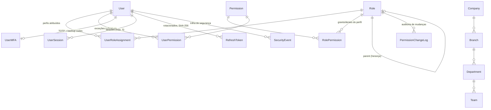

# IAM do Avequi — Documentação As-Built (F8.2, #354)

> **Status:** reflete a `main` em 11/07/2026 (v1.8.0). RBAC v2 cobre os blocos
> **A–E + G** da migração #341; resta só o **CRM (bloco F, #624)** no enum legado.
>
> Documentos relacionados:
> - [`ARQUITETURA-IAM-V2.md`](./ARQUITETURA-IAM-V2.md) — a **proposta** (#334) que originou tudo. Este doc descreve **o que foi construído**.
> - [`../RBAC.md`](../RBAC.md) — matriz do **enum legado** (@Roles, #453). Vale só para o CRM até o #624 fechar.

---

## 1. Visão geral

Autorização em **duas camadas coexistentes** durante a migração:

| Camada | Decorator | Guard | Estado |
|---|---|---|---|
| **RBAC v2** (permissões granulares) | `@RequirePermission('modulo.recurso.acao')` | `PermissionGuard` | **Padrão** — blocos A–E+G migrados |
| Enum legado (10 papéis) | `@Roles('MANAGER', ...)` | `RolesGuard` | Só CRM (#624) |

O catálogo tem **266 permissões** (`permissions.catalog.ts`) e **28 perfis system**
(`roles.catalog.ts`) — ambos **versionados em código** e aplicados no banco por um
**seed idempotente** (`prisma/seeds/iam.seed.ts`, `npm run db:seed:iam`).

**Princípio geral: fail-closed.** Na dúvida, negar — no backend (guards), no
frontend (nav/`<Can>` escondem enquanto carrega) e no seed (perfis system são
reconciliados; custom nunca são tocados).

## 2. Enforcement — os 5 guards globais (ordem importa)

Registrados via `APP_GUARD` em `app.module.ts`, executam **nesta ordem** em toda rota:

```
1. JwtAuthGuard      — autentica o JWT (respeita @Public)
2. CompanyGuard      — amarra o request à empresa do token (multi-tenant)
3. RolesGuard        — @Roles legado (sem exceção automática pra SUPER_ADMIN)
4. PermissionGuard   — @RequirePermission (RBAC v2), DEPOIS do RolesGuard
5. ThrottlerGuard    — rate limit (60 req/60s global; login 5/60s; refresh 10/60s)
```

- `@RequirePermission('a.b.c', 'x.y.z')` = exige **TODAS** (semântica AND). OR
  genuíno = sinal de que a ação merece um code próprio no catálogo.
- `@Public()` marca rota sem JWT — **allowlist exata verificada em CI** (ver §7).
- Rota sem nenhum decorator = qualquer autenticado. Pós-bloco G isso é exceção
  consciente (self-service do próprio usuário; portal do fornecedor com token próprio).

## 3. Modelo de dados (ER)



Pontos que pegam gente nova:

- **`Role.parentId`** — herança de perfis (Supervisor herda Operador). A resolução
  é defensiva contra ciclos (profundidade máx. 20, `access-lockout.util.ts`).
- **`RolePermission.granted`** — um perfil pode **negar** (deny) uma permissão.
- **`UserPermission`** — exceção individual (grant OU deny) com `expiresAt` e
  `reason` auditável.
- **`UserRoleAssignment`** — pode ter escopo de filial e expiração; expirados são
  filtrados na resolução.
- **Perfis system** (`isSystem=true`, `companyId=null`) vêm do catálogo; perfis
  custom de empresa nunca são alterados pelo seed.

## 4. Resolução de permissões efetivas

`PermissionService.getEffectivePermissions(userId, companyId)`:

```
efetivo = ∪(permissões dos perfis ativos, com herança parent→child)
        − denies de perfil (RolePermission.granted=false)
        + grants individuais (UserPermission granted=true)   ← vence deny de perfil
        − denies individuais (granted=false)                 ← vence grant individual
```

**Precedência (do mais fraco ao mais forte):** grant de perfil → deny de perfil →
grant individual → deny individual. Lista vazia de perfis = conjunto vazio
(na dúvida, restringir).

- **Cache Redis, TTL 5 min** (`permission-cache.service.ts`), com fallback gracioso
  (Redis fora → resolve no banco). Mutações de acesso invalidam a chave do usuário.
- **Wildcard** (`sales.*`, `sales.orders.*`, `*`): só sufixo; padrão inválido →
  `false` sem lançar. O frontend espelha a MESMA semântica (`permission-match.ts`).
- **Legacy fallback**: usuário sem assignment v2 recebe permissões derivadas do
  enum (`ENUM_ROLE_TO_SYSTEM_ROLE`). `GET /auth/me/permissions` expõe
  `legacyFallback: true/false` — em produção o admin está `false` desde o seed 260.
- **Shadow mode** (`shadow-mode.service.ts`, fase M2 do #340): compara a decisão
  do motor v2 com o legado e **loga divergências sem bloquear** — nunca lança.

## 5. Autenticação — fluxos

### Login (`POST /auth/login`, @Public, throttle 5/60s)
1. **Lockout**: 5 falhas em 15 min → bloqueio em escada (30m → 60m → 2h → 4h → 24h).
2. Senha (bcrypt) + **política de senha** (`password-policy.service.ts`: complexidade,
   histórico, expiração — senha expirada retorna `passwordChangeRequired` e o
   `POST /auth/change-password` é @Public exigindo a senha atual).
3. **MFA**: se habilitado (ou exigido pelo perfil, `roleRequiresMfa`), o login vira
   challenge — `POST /auth/mfa/verify` (@Public, pré-token) valida TOTP/backup code.
4. Emite **access + refresh** (refresh **rotacionado**, persistido como **SHA-256**;
   refresh revogado/expirado → 401). *Obs.: detecção ativa de REUSO de refresh
   antigo (`TOKEN_REUSE_DETECTED` existe no enum) ainda NÃO é emitida — é a
   Fase F3.x da proposta, não implementada.*
5. **Sessão** registrada (`UserSession`, máx. **5 simultâneas** — a mais antiga cai).
   Revogação individual/total em `/auth/sessions`; a **denylist Redis** corta access
   tokens vivos da sessão revogada criticamente — consultada pela **JwtStrategy** em
   toda request autenticada com claim `sessionId` (#823; 401 antes dos guards de
   empresa/papel/permissão). Best-effort: Redis fora → **fail-open** por
   disponibilidade (log ERROR estruturado; o token expira naturalmente em até
   `JWT_EXPIRY` = 15 min e o refresh segue bloqueado pelos mecanismos persistentes).
   Tokens legados sem `sessionId` (transição M4) não consultam.

### MFA (`/auth/mfa/*` — self-service, autenticado)
- `setup` → segredo TOTP (criptografado via `EncryptionService`/`ENCRYPTION_KEY`;
  sem a chave, MFA responde **503 fail-fast**) + QR otpauth.
- `confirm` → habilita e entrega **10 backup codes** (bcrypt, uso único, exibidos UMA vez).
- `disable` → exige **senha + código** do próprio dono.
- **Reset por ADMIN** (#545): `POST /iam/users/:userId/mfa/reset` — para quem perdeu
  o celular **e** os backup codes. Gate `iam.roles.assign` (só ADMIN_GLOBAL/
  ADMIN_EMPRESA), **reautenticação por senha do admin**, **nunca a própria conta**
  (quatro olhos), alvo escopado por empresa (anti-IDOR), `SecurityEvent` síncrono
  com `resetByUserId`.

### Eventos de segurança
`SecurityEvent` (LOGIN_SUCCESS/FAILED, PASSWORD_CHANGED, MFA_ENABLED/DISABLED,
SESSION_REVOKED, LOCKOUT...) — síncronos na mesma transação
quando a ação é sensível. Mudanças de perfil/permissão geram `PermissionChangeLog`
(com diff, `audit-diff.util.ts`); o `AuditInterceptor` global cobre o CRUD comum.

## 6. Administração de acesso (telas + API)

| Operação | Endpoint | Permissão |
|---|---|---|
| Listar/criar/editar perfis | `/iam/roles*` | `iam.roles.view` / `iam.roles.manage` |
| Atribuir/remover perfil de usuário | `/iam/users/:id/roles*` | `iam.roles.assign` |
| Exceções individuais (grant/deny) | `/iam/users/:id/permissions*` | `iam.roles.assign` |
| Reset de MFA por admin (#545) | `/iam/users/:id/mfa/reset` | `iam.roles.assign` |
| Organização (filial/depto/equipe) | `/iam/org*` | `iam.org.view` / `manage` / `assign` |
| Log de auditoria | `/iam/audit-logs` | `iam.audit-logs.view` |

Salvaguardas de servidor: **anti-auto-lockout** (400 ao remover o próprio acesso à
gestão), denies não trancam SUPER_ADMIN fora da gestão, alvo sempre da MESMA empresa.

## 7. Sentinelas de CI (testes que impedem regressão)

| Spec | O que garante |
|---|---|
| `common/guards/route-gate-coverage.spec.ts` (#693) | **Toda rota** da API tem classificação explícita: permissão, roles, `@Public` (allowlist exata de 14) ou exceção consciente. Listas de pendência têm **anti-estagnação** — migrou, tem que remover. |
| `common/guards/route-shadowing.spec.ts` (#699) | Nenhum controller aninhado (`fiscal/manifest`, `finance/budget`, `production/schedule`) registra DEPOIS de um pai com `@Get(':id')` — a classe de bug #686/#698 não volta. |
| `iam/permission.service.spec.ts` (32 casos) | Semântica de resolução: precedência deny>grant, herança com ciclo, expiração, cache. |
| `pr341*.access.spec.ts` (por bloco) | Acesso efetivo dos perfis reais contra os controllers reais. |
| `permissions.catalog.spec` / `roles.catalog.spec` / `iam.seed.spec` | Catálogo íntegro e seed idempotente. |

## 8. Frontend (issue #351, PRs #472/#689/#701)

- **`usePermission()`** — `can/cannot/canAny/canAll/hasRole` sobre
  `GET /auth/me/permissions` (TanStack Query, staleTime 5 min = TTL do cache Redis).
- **`<Can permission|anyOf|allOf fallback loading>`** — render condicional fail-closed.
- **`NavItem.permission`** (nav-config) — MESMO campo esconde item do menu
  (sidebar/palette/favoritos) e bloqueia a rota (RouteGuard, status `loading`
  segura o render). `roles` legado no nav restou **só para o CRM**.
- Regra de ouro: **frontend é UX, não segurança** — o backend sempre revalida.

## 9. Receitas (como fazer sem quebrar nada)

**Adicionar uma permissão nova**
1. Code no `permissions.catalog.ts` (`modulo.recurso.acao`, com rota de referência).
2. Vínculos nos perfis em `roles.catalog.ts` (matriz = decisão do Rafael).
3. `@RequirePermission` na rota. 4. Rodar seed em prod ANTES do deploy do gate
   (ordem merge→seed→deploy: a janela fica fail-closed, nunca fail-open).
5. Se tem tela: `permission` no nav-config + `<Can>` nos botões.

**Migrar um controller do enum → v2** (padrão dos blocos A–G)
1. Definir codes (reusar família existente evita mexer na matriz).
2. Trocar `@Roles` → `@RequirePermission` em TODAS as rotas (gate único).
3. Remover o controller do `PENDING_MIGRATION` do route-gate-coverage.spec
   (o teste anti-estagnação cobra). 4. Access-spec do bloco. 5. Smoke pós-deploy.

**Troubleshooting**
- **403 com permissão “certa”** → conferir `legacyFallback` no `/auth/me/permissions`
  (usuário sem assignment v2?) e o cache (5 min; mutações invalidam).
- **404 em rota que existe** → shadowing por `:id` (rodar route-shadowing.spec).
- **MFA 503** → `ENCRYPTION_KEY` ausente no ambiente (fail-fast proposital).
- **Login 429** → throttle (5/60s) ou lockout em escada (ver `SecurityEvent LOCKOUT`).

---

*Gerado na F8.2 (#354) — mantenha este arquivo quando mexer em guards, catálogo,
fluxos de auth ou nas sentinelas. Se este doc discordar do código, o código vence:
corrija AQUI.*
